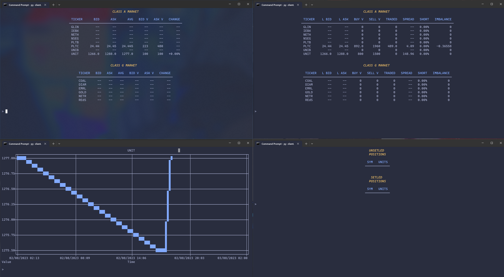

    <h1 align="center">MC-UMSR-NSE-Market-System</h1>
    

        The NSE Market System is an exchange management system developed by members of the UMSR Minecraft Server.
        It's used among server members to trade in in-game financial markets dealing in equities, derivatives and commodities.
    

    

## What's the UMSR?
The UMSR is a private Minecraft Server founded in 2019 with the goal of developing an efficient in-game economic and political system which facilitates growth and allows people to have more fun by avoiding bording tasks. The server implements a free market economy with its own currency, central bank, government, private corporations and financial markets.

## Why NSE Market System?
Since 2020, people on the server have been using a proprietary market management system to trade in in-game financial instruments using exclusively in-game money. However, the system needed to be repalced due to software shortcomings and had to be rewritten from the ground up.
In-game financial markets enhance liquidity and reduced overall volatility in the economy, allowing for more rapid growth and more efficient allocation of resources.

## Features of NSE Market System
* Market data visualization in tables and charts
* Limit and Market Orders
* Order cancelation
* Real-Time order matching
* Session management and settlement
* Asset-short and Cash-short positions
* Easy transfer of assets between accounts
* Digital payments with in-game currency
* Periodic E-Mail messages to users with up-to-date market information
* JSON API over TCP (Using UNet and MCom)
* Up to 2250 orders per ticker per second (0.44 ms/order)

## Disclaimer
This software is meant to be used exclusively with "play money" and may not be compatible with world regulations such as those of the SEC (Securities Exchange Commission) or other regulatory institutions and frameworks. Given its private nature and the short development time, it also lacks many security features which may make it incompatible with privacy and data security regulations such as the GDPR.
The NSE Market System is designed to work on the UMSR Minecraft Server with in-game money and assets, in complience with in-game regulations and rules around financial markets and under the watchful eye of in-game regulatory institutions. Use it at your own risk, neither the author of the software, nor the UMSR Minecraft Server and its members take any responsibility. As per the LICENSE agreement detailed in the LICENSE file, the software is not guaranteed for fitness either.
